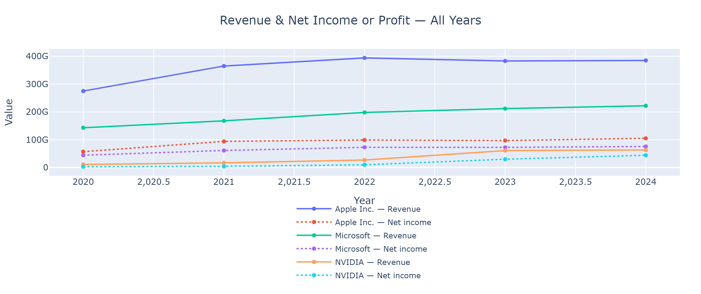
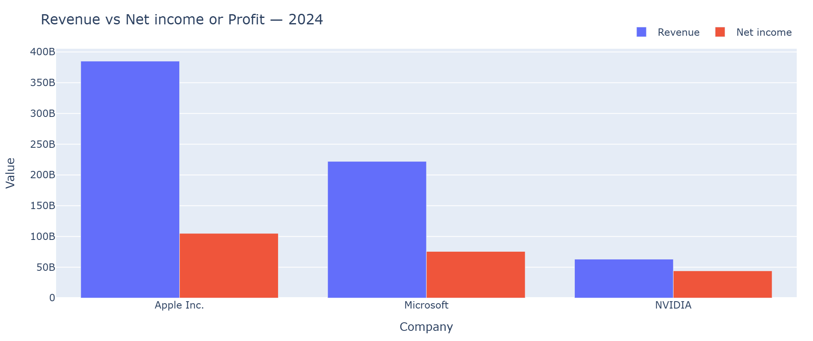
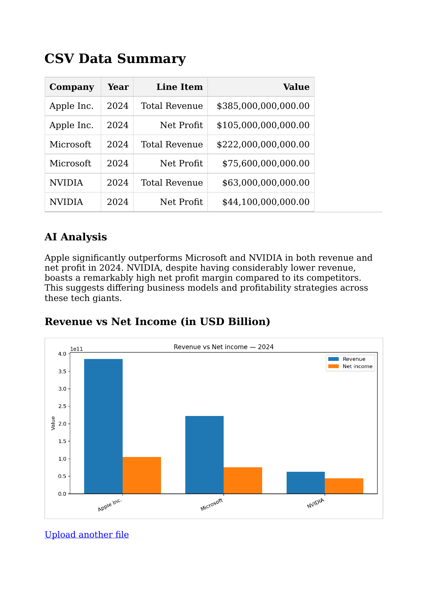

Capstone‑FinGPT
===============

A lightweight Flask web app to ingest financial statements, normalize them into a canonical schema, generate AI-powered multi-paragraph analysis, compute Tier-1 financial ratios, produce charts (Plotly), and export PDF/Excel reports.

🚀 Live demo

Render: https://capstone-fingpt.onrender.com

Render deployment notes:
- ✅   Free tier.
- ✅   First visit after idle may cold-start (a minute or two).
- ✅   If you see “Too many requests” on the home page, refresh once; if it persists, wait ~60s.

📘 Repository

https://github.com/weeinn2025/Capstone-FinGPT

> ⚠️**Disclaimer**
> The sample dataset in this repository is illustrative and may mix calendar and
> fiscal years because companies have different year-ends (e.g., Apple ≈ late Sep,
> Microsoft ≈ Jun 30, NVIDIA ≈ late Jan). Values are simplified or rounded and may not
> match audited filings. Do not use for investment decisions. Always verify
> against the company’s latest 10-K/10-Q or annual report.

> 🔒 **Privacy Note**  
> This project does not collect, store, or process any personal data.
> Uploaded files are used in memory and discarded at runtime.  
> All included datasets are illustrative, anonymized, or publicly available.  
> Users are responsible for ensuring compliance with their own data protection, PDPA, or regulatory requirements when adapting this project.


Features
========
## Feature Disclaimer  
*  The application is a work in progress with ongoing enhancements, including advanced features, visualization, and AI.
*  This public release provides the core functionality only, while certain advanced features, analytics, and integrations are reserved for internal/private use and may be showcased selectively in the future (demo available upon request).
*  Some advanced features (RAG, caching, AI tuning, CI hardening) are implemented but **private-mode features** may continue separately.

1.   **Upload multiple formats - flexible ingest**
     (Accepted file formats for Data Input & Pre-processing)
     - ✅   support **.xlsx**  (via `pandas` + `openpyxl`- same logical columns; multiple sheets are supported (first valid sheet detected automatically or is read by default))
     - ✅   support **.csv**   (header row required, example: Company,Year,LineItem,Value)
     - ✅   support **.zip**   (uploads a `.zip` that contains one or more CSV/XLSX files - the app reads the **first valid** tabular file inside; demo size ~5 MB)
     - ✅   Auto-normalization → **Company | Year | LineItem | Value**

2.   **Samples included**
     - ✅   Located in `samples/` to test quickly (CSV/XLSX + ZIP fixtures).
     - ✅   Try the samples:   `sample_financials_2020_2024_xlsx` (for multi-company all-years line gragh), `sample_companies_2024.csv` (for multi-company grouped bars), `sample_income_statement.csv`, `sample_income_statement.xlsx`, `sample_csv_only.zip`, `sample_financials_rev1_2020_2024.csv`, sample_financials_rev1_2020_2024.xlsx`.
     - ✅   Use the Revised samples for latest enhancements:  `sample_financials_rev2_2020_2024.csv`, sample_financials_rev2_2020_2024.xlsx`.

3.   **Preview before analysis**
     - ✅   see the **first 10 rows** on a `/preview` screen before analysis, then click **Analyze this file**.

4.   **Canonical Normalization**
     - ✅   Canonical schema (columns): Company | Year | LineItem | Value.
     - ✅   Canonical LineItem mapping (Revenue, Net Income, Assets, Liabilities, Equity).
     - ✅   Column trimming, whitespace cleanup.
     - ✅   Trims headers, numeric coercion, drops blank rows. 
     - ✅   Falls back to raw columns if mapping fails.
     - ✅   Strict data validation (invalid rows → friendly error with samples).
 
5.   **AI summary - AI Analysis (Gemini)**
     - ✅   Generates a concise 3-5 sentence narrative on multi-year performance via **Gemini** when `GEMINI_*` env vars are set.
     - ✅   Graceful fallback when AI is disabled.
     - ✅   The app also works without AI keys, showing a friendly ‘AI disabled’ note while still rendering summary, charts, and PDF.
     - ✅   Further details explained as below:

> ### AI Modes
Selectable via form or env:
- `descriptive`   – Summary only  
- `ratios`        – Ratios Focus only  
- `both`          – Summary + Ratios (default)  
- `none`          – No AI  

> ### P0/P1/P2 AI Enhancements
✓ P0 – Stability
- Default **summary model**: `gemini-2.5-flash`  
- Hard caps on:  
  - rows per company  
  - total prompt length (`_clean_prompt(max_len=12000)`)  

✓ P1 – Safety & Determinism
- New cache key: `mode|model|time_bucket|sha1(prompt)`  
- Eliminates cross-mixing between summary/ratios models  
- Explicit sort by `Company, Year` before prompt generation  

✓ P2 – Observability & Routing
- `AI_MODEL_SUMMARY` + `AI_MODEL_RATIOS` environment overrides  
- Default routes:  
  - Summary → `gemini-2.5-flash`  
  - Ratios → `gemini-2.5-pro`  
- Added `prompt_debug.log` capturing:  
  - timestamp, mode, model, number of lines, prompt size  

> ### AI Output
- Multi-paragraph, per-company financial summaries  
- Ratios Focus: 2–3 sentence analysis per company, covering:  
  - Liquidity (margin trend)  
  - Leverage (D/E, D/A)  
  - Momentum (Rev YoY, NI YoY)  
- Strictly no forecasts, no invented data  

> ### Fallbacks
- Secondary retries  
- Ultra-short fallback  
- Rule-based deterministic summary  


6.   **Interactive charts (Plotly) - dashboard**
     - ✅   Latest-year grouped bars of **Revenue** vs **Net income** for the **latest year**.
     - ✅   Canonicalizes line items so common names map correctly - Synonym mapping (≈):
     -       *  Revenue: “revenue”, “total revenue”, “sales”, “total sales”
     -       *  Net income: “net income”, “net profit”, “profit”
     - ✅   Multi-year line graph (all years, all companies): **Multi-year Revenue & Net income**.
     - ✅   Generates PNG for PDF export.
     - ✅   Plotly → Kaleido fallback to Matplotlib - Fallback to Matplotlib PNG snapshot when Kaleido unavailable. For example, if Plotly JSON is not present, the page falls back to a static PNG.
  

7.   **PDF export report (WeasyPrint) - Data + Chart + AI analysis**
     - ✅   Includes data table, AI text, and the **same chart** as an image.
     - ✅   Renders a bar chart and lets you **download a nicely formatted PDF**.
     - ✅   One-click Download as PDF renders the data + AI text and embeds the same chart as a PNG.
     - ✅   Primary path: Plotly **via Kaleido → PNG → PDF**.  
     - ✅   Fallback: **Matplotlib grouped bars** (no Chrome/Kaleido required).
     - ✅   If Kaleido is unavailable, export still works via a Matplotlib grouped snapshot.
     - ✅   To enable Plotly → PNG locally, install Chrome once using:
            ```bash
             plotly_get_chrome
     - ✅   Tier-1 financial ratios and alerts table included.
     - ✅   Revenue & Net Income charts embedded (latest year + multi-year).
     - ✅   Fixed column widths for clean alignment in wide tables.
     - ✅   Basically shows:  Summary table, AI Analysis, Ratios Focus section, Charts embedded as PNG, Clean layout with controlled column widths. 

8.  **Excel export**
     - ✅   Tier-1 ratios + alerts exported as a formatted Excel workbook.
     - ✅   Revenue/Net Income formatting (k, % formatting).
     - ✅   Percentages shown with 2 decimals.
     - ✅   Alert columns display **colored filled cells (green/red/gray)** for clearer readability.   

9.  **Safety & validation**
     - ✅   `GET /` (home page) is **not** rate-limited;  
     - ✅   Uploads file size limited to 5-10 MB, `POST /preview` and `POST /upload` are limited to **10 requests per minute** per endpoint (demo safety).
     - ✅   For production → configure a shared store or use Redis/Memcached with Flask-Limiter (Flask-Limiter with Redis optional). 
     - ✅   “This is what the output looks like” with short narrative - AI analysis:

 
### 📊 Interactive Charts & PDF Export  

- Upload → Normalize → AI Analysis → Chart → PDF Download  
- Live screenshots from the Render demo:

**Revenue & Net Income (Chart 1 – Multi-Year Line Graph):**  


**Revenue & Net Income (Chart 2 – Latest Year Bar Graph):**  


**Generated PDF Report (includes table, AI analysis & chart):**

Preview (first page):  
  

[📄 Download Sample PDF](static/screenshots/report_ai_analysis.pdf)

**To Note:**
• Different fiscal year-ends (Apple: late Sep; Microsoft: Jun 30; NVIDIA: late Jan).
• Some of 2024 lines appear to be calendar-year or a later fiscal year instead of each company’s FY2024.
• One Apple row (“Shareholders’ Equity $75B”) seems copied from an earlier year; Apple shows negative equity in FY2024 due to buybacks. 
[annualreports.com]
      

10.  **Clear error messages** for unreadable or invalid files.


How it flows
============

**Mermaid block**
```md
```mermaid
graph LR
A[Upload CSV/XLSX/ZIP] --> B[Normalize & Validate]
B --> C[Preview table]
B --> D[AI Summary (Gemini)]
B --> E[AI Ratios Focus]
B --> F[Plotly interactive charts/grouped bars (latest year)]
F --> G[PNG Export (WeasyPrint)]
G --> H[PDF Export]


Prerequisites
=============

1.   Python 3.11

2.   Git or GitHub

3.   (Optional) Conda or virtualenv for isolation


Local Setup
===========

1.   Clone your repository

     git clone https://github.com/weeinn2025/Capstone-FinGPT.git
     cd Capstone-FinGPT

2.   Create and activate the environment

     conda create -n ml python=3.11
     conda activate ml
     # or use virtualenv
     
     FLASK_SECRET_KEY=<random_24+_bytes_or_hex>
     # Optional (for AI text)
     GEMINI_API_KEY=<your key>
     GEMINI_URL=https://generativelanguage.googleapis.com/v1beta/models/gemini-1.5-flash-latest:generateContent

3.   *Install all the dependencies*:

```bash
pip install -r requirements.txt
```

4.   Configure the environment

     Copy.env.example → .env

     Set your FLASK_SECRET_KEY, GEMINI_API_KEY, and GEMINI_URL.

     *  Environment variables:

     GEMINI_API_KEY	(Optional)  --- >  Google Gemini API key
     GEMINI_MODEL	(Optional)  --- >  Model name; e.g., gemini-2.5-flash
     (If these are unset, analysis runs without AI text).


5.   Then Run locally:
     flask run or python app.py

     # Visit http://127.0.0.1:5000


Using the app
=============

1.   First, navigate to the home page and upload a file (.csv, .xlsx, or .zip).

2.   Then, click Preview to see the first 10 rows in your browser.

3.   Click Analyze this file to:
     -  show a normalized summary table.
     -  generate AI analysis/text (if env is set), and the interactive chart.
     -  render a bar chart, line graph

4.   You are able to click Download as PDF to save the report.


Dev & CI
========

- ✅   Lint/format: Black + Flake8 (run locally with black . && flake8).

- ✅   Pre-commit [optional]:
       ```md
       ```bash
       pip install pre-commit
       pre-commit install


Testing & linting
=================

- ✅   Run the linters and tests from the project root:
       ```md
       ```bash
       black . && flake8 . && pytest -q

- ✅   If you don’t have the tools yet:
       ```md
       ```bash
       pip install black flake8 pytest

(Works the same in macOS/Linux terminals and Windows PowerShell.)


Deployment
==========
⚠️ Security best practices:  
- Never commit your `.env` file or API keys.  
- Use HTTPS in production and run Flask with Gunicorn/uWSGI.  
- Consider Redis/Memcached for distributed rate limiting.  

Render (✅ Done)

1.   Add runtime.txt with:
     *  python-3.11.11
2.   Ensure requirements.txt includes:
     *  gunicorn==20.1.0
3.   Environment variables set on Render dashboard.
4.   Connect your GitHub repo & deploy.  Cold starts expected on free tier.
5.   Static logs + AI debug logs available in Render console


Troubleshooting
===============

✅   Blank interactive chart:
     *  confirm at least one year has both Revenue and Net income (synonyms above).

✅   PDF uses Matplotlib, if Kaleido not available:
     *  install Chrome via plotly_get_chrome (optional).    

✅   ZIPs not in Git:
     *  ZIPs are ignored globally but allowed in samples/ (see .gitignore).


Project Structure
=================

Capstone-FinGPT/
├─ app.py
├─ app_validators.py
├─ requirements.txt
├─ runtime.txt
├─ Dockerfile
├─ docker-compose.yml
├─ README.md
├─ README_CI.md
├─ .env.example
├─ .gitignore
├─ .flake8
├─ .pre-commit-config.yaml
├─ prompt_debug.log        # (P2)
├─ templates/
│  ├─ index.html
│  ├─ preview.html
│  ├─ result.html         # interactive Plotly (or static fallback)
│  └─ pdf.html            # WeasyPrint layout for PDF
├─ samples/
|  ├─ sample_financials_2020_2024.csv_only.zip
|  ├─ sample_financials_2020_2024.xlsx.zip
|  ├─ sample_financials_rev2_2020_2024.csv.zip
|  ├─ sample_financials_rev2_2020_2024.xlsx.zip
│  ├─ sample_companies_2024.csv
│  ├─ sample_income_statement.csv
│  ├─ sample_income_statement.xlsx
│  ├─ sample_csv_only.zip
│  ├─ sample_mixed_csv_xlsx.zip
│  └─ sample_xlsx_only.zip
├─ uploads/               # user uploads at runtime (gitignored)
│  └─ .gitkeep
├─ static/screenshots     # optional assets (logos/CSS/JS)
|  ├─ chart.png
|  ├─ pdf_sample.png
│  ├─ pdf_report_ai_analysis.pdf
├─ tests/                 # add unit tests here
│  └─ (placeholder)
│  ├─ test_smoke.py
│  ├─ test_data_validation.py
│  ├─ test_canonical_financials.py
└─ .github/workflows/
   └─ pr-ci.yml           # PR CI: lint, test, build smoke


License
MIT © 2025

